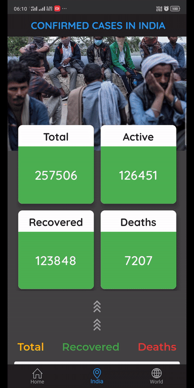
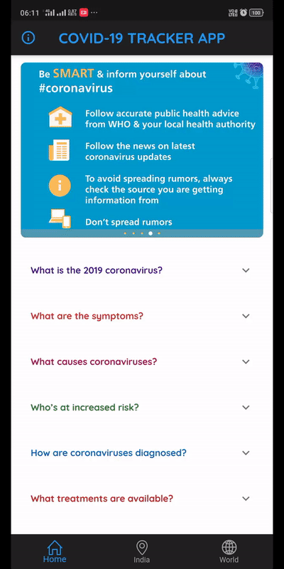

# COVID-19 TRACKER

#### Flutter App which provides covid-19 confirmed cases data of all the countries, Also gives basic information about COVID-19.You can download the app-release.apk file and install it in your device.

<h5> API used in this project:   "https://coronavirus-19-api.herokuapp.com/countries"   "https://api.rootnet.in/covid19-in/stats/latest"
      </h5>                          

</img>

## Getting Started
This project is a starting point for a Flutter application.

A few resources to get you started if this is your first Flutter project:

- [Lab: Write your first Flutter app](https://flutter.dev/docs/get-started/codelab)
- [Cookbook: Useful Flutter samples](https://flutter.dev/docs/cookbook)

For help getting started with Flutter, view our
[online documentation](https://flutter.dev/docs), which offers tutorials,
samples, guidance on mobile development, and a full API reference.
